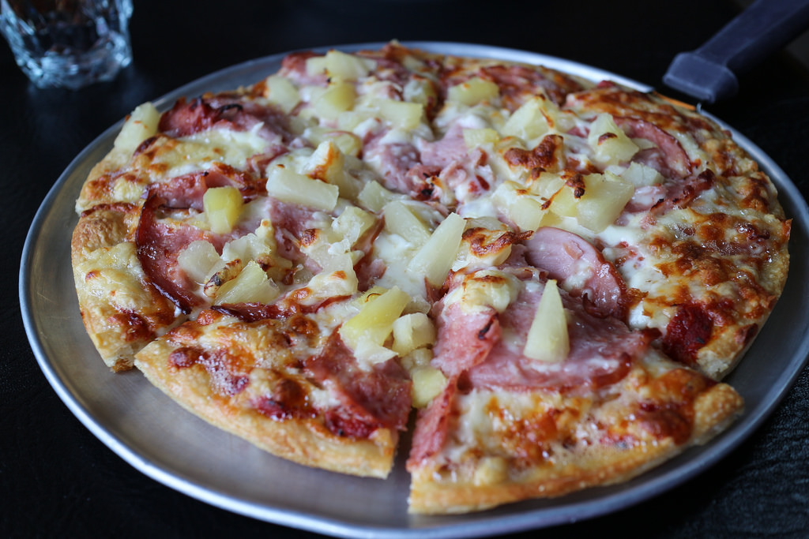
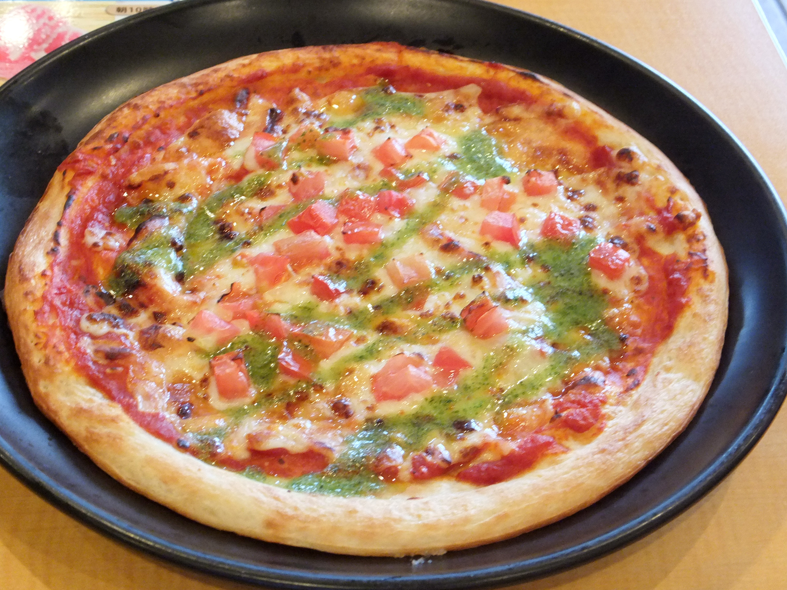

# Pizza
Example Rust Web App

Simple and small webapp that just returns the pizza of the day:

```
$ cargo run &
Finished dev [unoptimized + debuginfo] target(s) in 0.0 secs
     Running `target/debug/pizza`
$ curl localhost:8000
   <!DOCTYPE html>
        <html lang=en>
        <head>
            <meta charset=utf-8>
            <title>Hawaiian</title>
        </head>
        <body>
            <h1>Today's Pizza is Hawaiian</h1>
            
            <p>Ham and pineapple, the most controvesial of pizzas</p>
        </body>
        </html>
```

The pizza can changed through an environment variable (choices are Hawaiian,
Quattro Formaggi, Margherita or Four Seasons):

```
$ PIZZA=Margherita cargo run &
Finished dev [unoptimized + debuginfo] target(s) in 0.0 secs
     Running `target/debug/pizza`
$ curl localhost:8000

        <!DOCTYPE html>
        <html lang=en>
        <head>
            <meta charset=utf-8>
            <title>Margherita</title>
        </head>
        <body>
            <h1>Today's Pizza is Margherita</h1>
            
            <p>Basically cheese and tomato</p>
        </body>
        </html>
...
```

There is also a Docker build file and a Kubernetes deployment yaml.

The application was made to demonstrate how image pull policies work in
Kubernetes. It may also be of interest to developers looking at using Rust with
Docker/Kubernetes, and also as an intro to [Rocket](https://rocket.rs).
